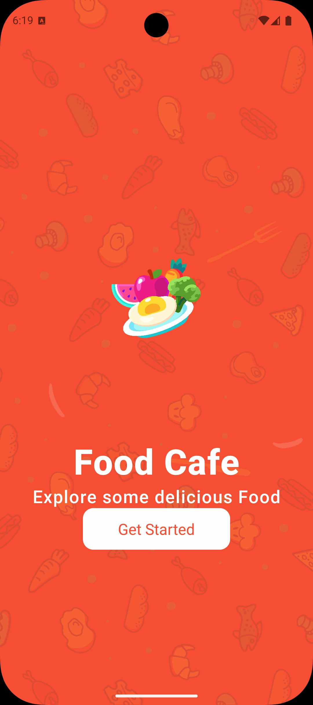
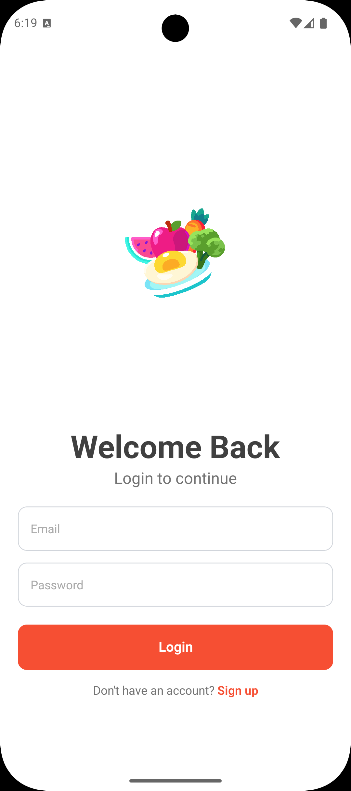
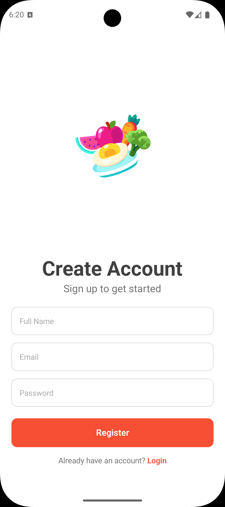
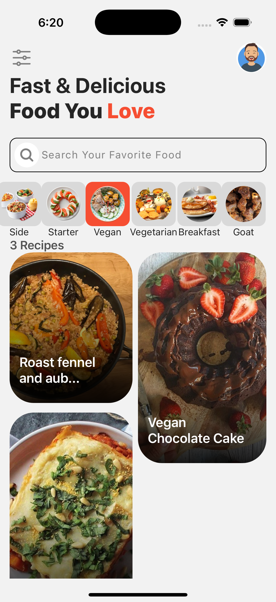
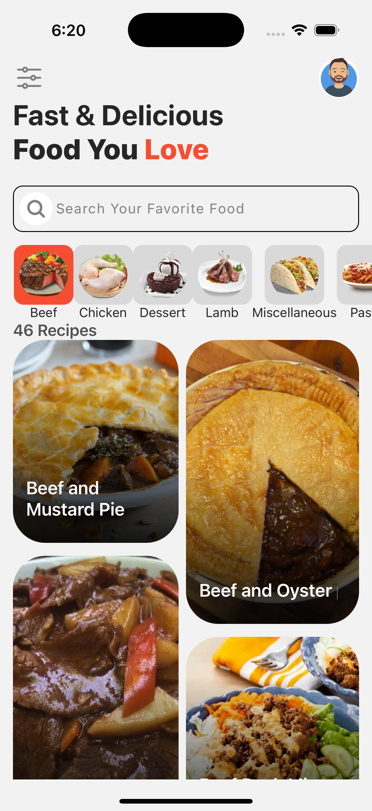
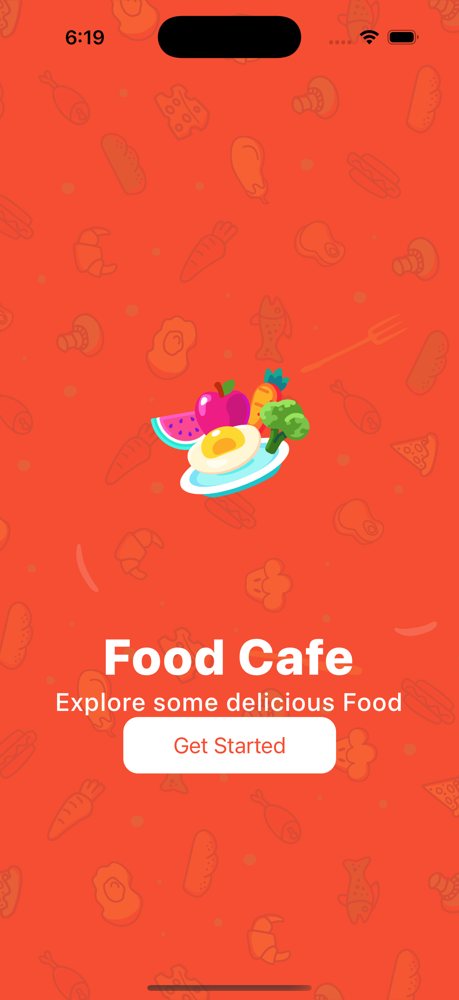
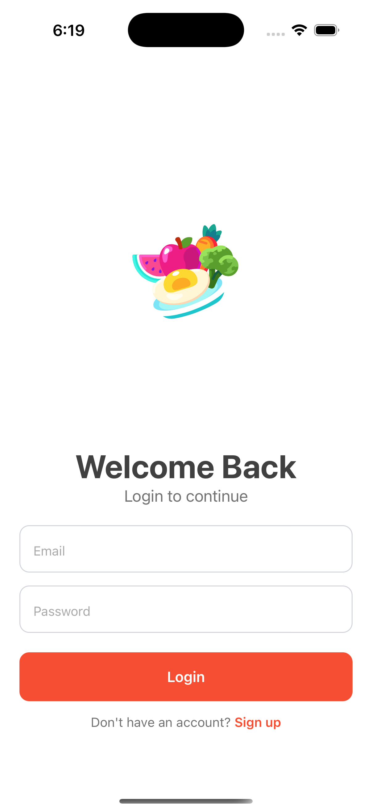
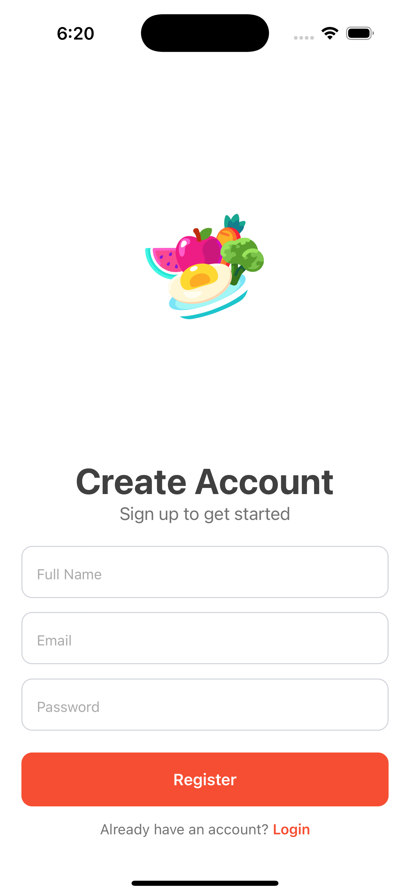
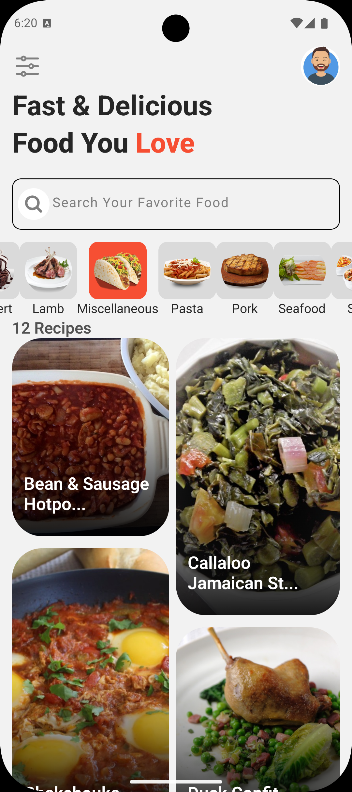
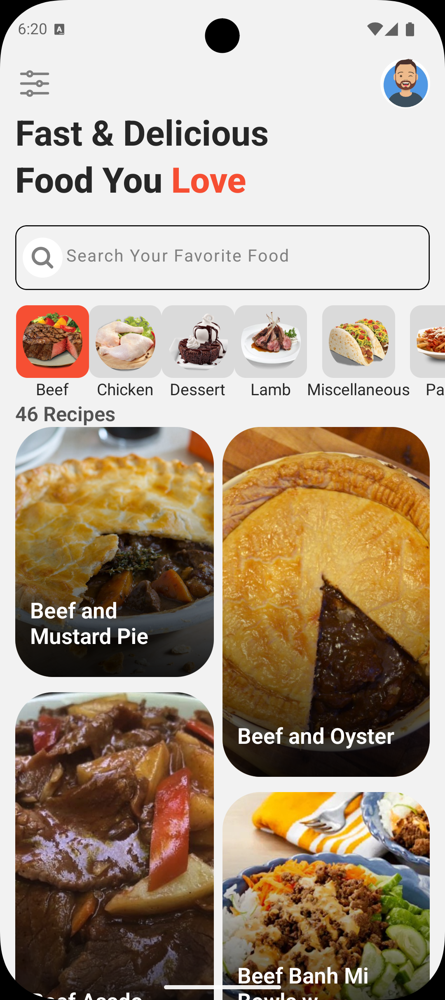

# 🍽️ Food Recipe App

  
*A beautiful and responsive mobile app to explore, search, and view delicious meal recipes from around the world.*

---

# 📸 Screenshots

## 📸 Android Screenshots

| Get Started | Login | Signup |
|-------------|--------|--------|
|  |  |  |

| Register | Home 1 | Home 2 |
|----------|--------|--------|
|  |  |  |

| Recipe Details |
|----------------|
|  |

---

## 📸 Ios Screenshots

| Get Started | Login | Signup |
|-------------|--------|--------|
|  |  |  |

| Register | Home 1 | Home 2 |
|----------|--------|--------|
|  |  |  |

| Recipe Details |
|----------------|
|  |

## ✨ Purpose of the App

> This app allows users to browse through a vast collection of food recipes using **TheMealDB API**.  
> It displays meal details, ingredients, and cooking instructions in an organized and interactive format.  
> Inspired by food lovers and designed for home cooks who want recipe ideas in a single tap.

---

## 🛠 Tech Stack

- **Frontend:** React Native, Expo
- **Styling:** StyleSheet (React Native), `react-native-responsive-screen`
- **Icons:** `react-native-heroicons`
- **Animation:** `react-native-reanimated`
- **HTTP Client:** Axios
- **Caching:** AsyncStorage
- **API:** [TheMealDB](https://www.themealdb.com/api.php)

---

## 🤝 Collaborators

| Name        | GitHub                                   | Email                    |
|-------------|------------------------------------------|--------------------------|
| Rahul Raj   | [@rahulraj](https://github.com/rahulraj) | rahulraj@example.com     |


---

## 📚 What We Learned

- Building UI with React Native components like `ScrollView`, `TouchableOpacity`, and `Animated.View`.
- Efficient image caching using AsyncStorage.
- Fetching dynamic API data and rendering meal details.
- Using `react-native-reanimated` for smooth transitions.
- Organizing project structure with reusable components and utility functions.
- Mobile-first responsive design using percentage-based dimensions.

---

## 🚧 Installation & Running Locally

```bash
# Clone the repository
git clone https://github.com/yourusername/food-recipe-app.git

# Navigate into the project
cd food-recipe-app

# Install dependencies
npm install

# Start the development server
npm start

